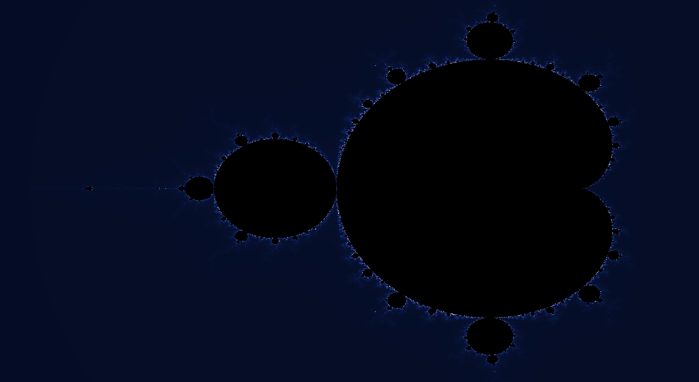

# Fractal Odyssey

### Explorando a matemática por trás dos padrões do universo

As fractais são estruturas matemáticas que apresentam padrões e detalhes em diferentes escalas. Elas surgem de regras matemáticas que, mesmo sendo simples, podem gerar formas de grande complexidade. Conceitos relacionados à geometria fractal também ajudam a estudar padrões encontrados na natureza, como ramificações, árvores, nuvens e outras estruturas.

O conceito de fractal foi desenvolvido e difundido por Benoît Mandelbrot, que cunhou o termo em 1975. O conjunto de Mandelbrot, por sua vez, começou a ser representado computacionalmente no final da década de 1970, com imagens iniciais de Robert Brooks e Peter Matelski, e foi estudado e visualizado por Mandelbrot por volta de 1980.

Este projeto explora a geometria fractal por meio de uma visualização do **conjunto de Mandelbrot**, utilizando cálculos matemáticos iterativos para gerar formas complexas e permitir uma aproximação contínua de suas estruturas.

## Demonstração

Acesse a página e veja o fractal sendo renderizado em tempo real no navegador:

**[▶️ Explorar Fractal](https://phsmontheiro-glitch.github.io/Fractal-Odyssey/)**

## Controles

| Tecla | Ação |
|---|---|
| `Z` | Ativa ou desativa o zoom automático |
| `↑` | Diminui a velocidade do zoom |
| `↓` | Aumenta a velocidade do zoom |
| `R` | Redefine a área de visualização |

O zoom automático explora uma região específica do conjunto de Mandelbrot, permitindo observar seus detalhes em diferentes escalas.

## Tecnologias e linguagens

- **JavaScript (JS):** lógica da aplicação e controle da animação.
- **p5.js:** criação e gerenciamento do canvas.
- **WebGL:** renderização gráfica acelerada por GPU no navegador.
- **GLSL:** shaders responsáveis pelos cálculos e pela geração visual do fractal.
- **Conjunto de Mandelbrot:** modelo matemático utilizado na visualização.

## Renderização com GPU

A geração do fractal envolve cálculos iterativos para diferentes pontos da imagem. Neste projeto, esses cálculos são executados nos shaders GLSL, utilizando a GPU por meio do WebGL.

Como a GPU consegue processar muitas operações gráficas em paralelo, ela permite distribuir os cálculos entre os pixels da imagem, reduzindo a carga de processamento que ficaria concentrada na CPU e tornando a renderização em tempo real mais viável.

A resolução do canvas é ajustada à janela e utiliza `pixelDensity(1)`, evitando o processamento de pixels extras em telas de alta densidade. Isso ajuda a controlar o custo computacional da renderização.

O desempenho, porém, depende da GPU, do navegador e das capacidades do dispositivo.

---

Desenvolvido por [Pedro Henrique Silva Monteiro](https://github.com/phsmontheiro-glitch).

